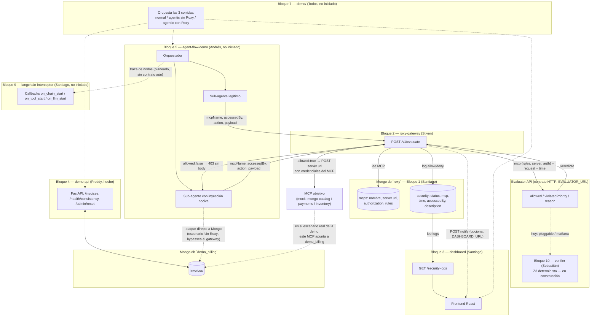
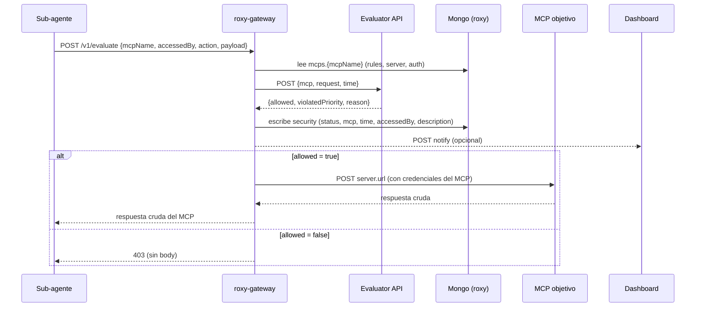
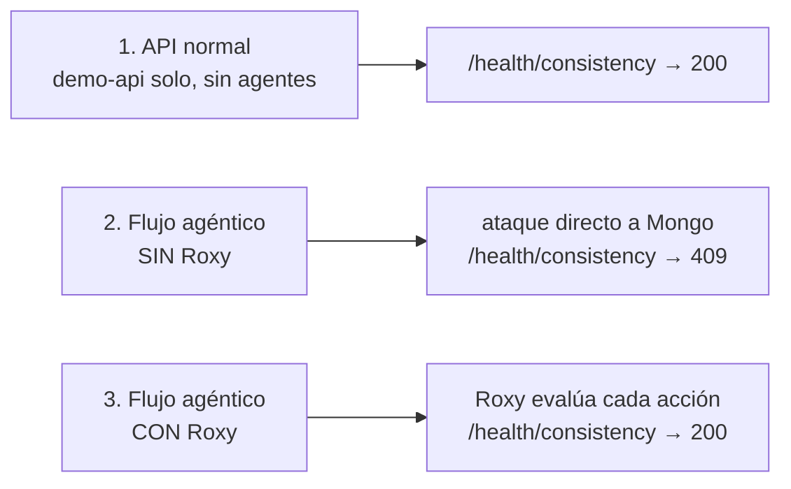

# Diagrama de arquitectura general

Reconstruido del estado actual del código en `main` (no de `idea.md` a
secas — varias piezas ya avanzaron más de lo que el checklist refleja).
Se itera a medida que entre más información al `idea.md`.

## Componentes y flujo de datos

## Flujo de una petición (con Roxy)

## Los 3 escenarios del demo (Bloque 7)

## Notas de estado (para no perder contexto al iterar)

- **Roxy Gateway ya no evalúa reglas él mismo.** Desde el merge más
  reciente, delega 100% la decisión a un **Evaluator API** externo vía
  `EVALUATOR_URL` (contrato HTTP: recibe `mcp + request + time`, responde
  `allowed/violatedPriority/reason`). El código LLM que tenía antes
  (OpenRouter, luego Claude Sonnet 5) se eliminó de `roxy-gateway/` — hoy
  el evaluator es un componente pluggable separado. **Este es exactamente
  el punto donde entra el Bloque 10 (`verifier/`, Sebastián, Z3
  determinista)** — aún no tiene código, solo la carpeta registrada en
  `CLAUDE.md`.
- **Roxy Gateway ahora sí llama al MCP real** (antes solo evaluaba y
  logueaba) — si el evaluator aprueba, hace el POST real a `server.url`
  con las credenciales del MCP, y devuelve la respuesta cruda al agente.
- Los 3 MCPs del mock (`mongo-catalog-mcp`, `payments-mcp`,
  `inventory-mcp`, en `mongo-data/population/mcps.mock.json`) apuntan a
  URLs ficticias (`https://mcp.internal/...`) — todavía no hay un MCP real
  registrado apuntando a `demo_billing`. Eso lo tiene que crear quien
  conecte el Bloque 5 (agent-flow-demo) al Bloque 2.
- **Bloques sin código aún:** `agent-flow-demo/` (5), `langchain-
  interceptor/` (9), `demo/` (7), `verifier/` (10), `landing-page/` (8).
  El diagrama de arriba ya anticipa su forma según lo que describe
  `idea.md`, pero se ajusta apenas suban algo real — por eso este doc
  vive en `research/`, para iterar rápido sin tocar código de ningún
  bloque.
- La notificación de Roxy al dashboard (`DASHBOARD_URL`) es opcional —
  si no está configurada, es no-op. El dashboard hoy solo expone `GET
  /security-logs` leyendo Mongo directo; no confirmé un endpoint que
  reciba ese POST de notificación.
