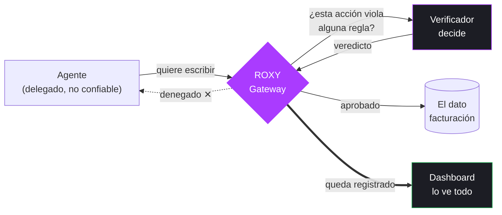
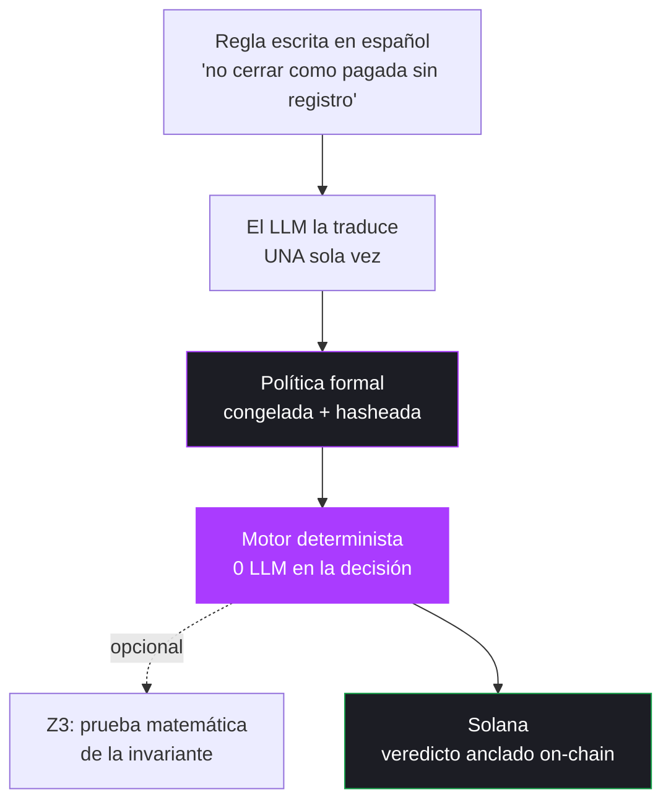
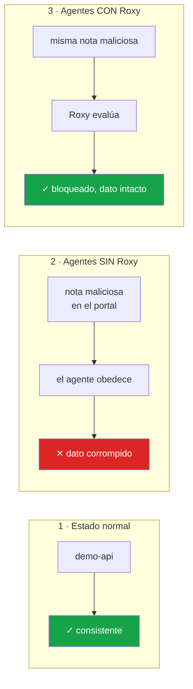
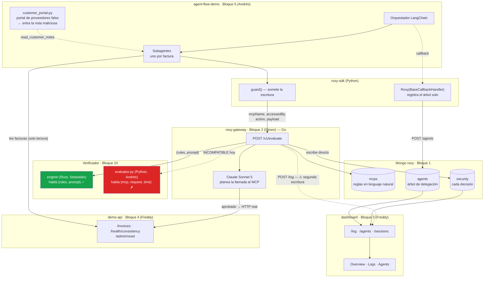

# Diagrama de arquitectura general

Reconstruido leyendo el código real en `main` y **probando los servicios
desplegados en vivo** (2026-08-23, 01:00). No es lo que dice `idea.md` ni
lo que dicen los README — es lo que efectivamente corre.

---

## 1. Diagrama para el tablero / deck (el que se muestra hablando)

Este es el que hay que dibujar. Todo lo demás es detalle técnico que no
va en la slide principal.

**El mensaje, sin decir una palabra técnica:** hay un punto único, en el
medio, que ve *todo* antes de que le llegue al dato — y nada pasa por ahí
sin quedar registrado.

---

## 2. Diagrama técnico — Z3 / Solana (la slide de ~8 segundos)

**La frase:** el LLM traduce la regla una vez; la decisión corre siempre
determinista sobre esa política ya congelada — mismo input, mismo
resultado, siempre. Y cada veredicto queda anclado en Solana: nadie,
ni nosotros, puede reescribir después lo que pasó.

---

## 3. Los 3 escenarios de la demo

---

## 4. Flujo real completo (referencia técnica, NO para slide)

---

## Estado verificado en vivo (2026-08-23, 01:00)

Probado con `curl` contra el despliegue real, no asumido:

| servicio | endpoint | estado |
|---|---|---|
| roxy-gateway | `https://roxygt.lat/gateway/health` | ✅ `{"service":"roxy","status":"ok"}` |
| dashboard API | `https://roxygt.lat/api/log` | ✅ devuelve logs reales |
| demo-api | `https://roxygt.lat/demo-api/health/consistency` | ✅ `consistent: true, checked: 30` |
| MCP server | `https://roxygt.lat/mcp` | ✅ responde (pide sesión) |

**La corrida con Roxy ya funcionó de verdad en prod**: hay denegaciones
reales en `security` de las 06:06 UTC de hoy, sobre
`agent-subtask-INV-1005` y `agent-subtask-INV-1011`, con el motivo
`"operation 1 (write on 'invoices') is denied by rule priority 1"`.

## ⚠ Dos problemas encontrados (ver `research/ISSUES.md`)

1. **Contrato del evaluador incompatible** entre `roxy-gateway` y
   `verifier/evaluator.py` — confirmado con una prueba real (422).
2. **Cada decisión se escribe dos veces** en `security` → el dashboard
   muestra todo duplicado.
