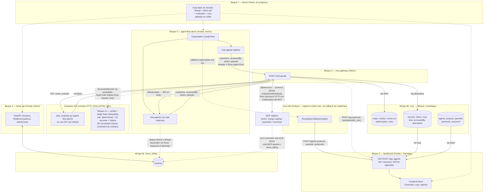
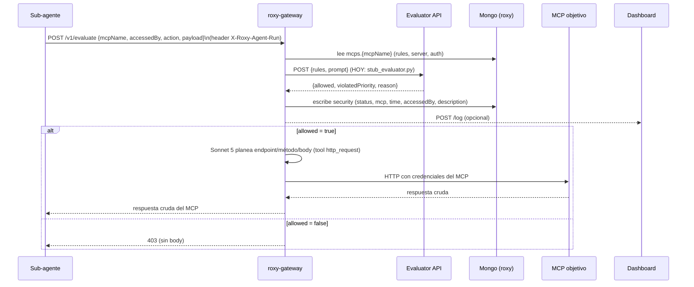
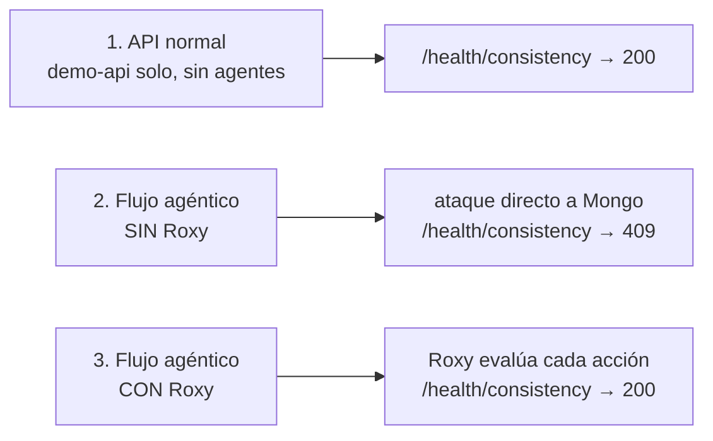

# Diagrama de arquitectura general

Reconstruido del estado actual del código en `main` (no de `idea.md` a
secas — varias piezas ya avanzaron más de lo que el checklist refleja).
Se itera a medida que entre más información al `idea.md`.

## Componentes y flujo de datos

## Flujo de una petición (con Roxy)

> Nota: el contrato real hoy es `{rules, prompt}` → evaluator, no
> `{mcp, request, time}`. Aegis Gate (Bloque 10) espera esta segunda
> forma — no está enchufado detrás de `EVALUATOR_URL` todavía.

## Los 3 escenarios del demo (Bloque 7)

## Notas de estado (actualizado 2026-08-23 — para no perder contexto al iterar)

- **Roxy Gateway no evalúa reglas él mismo.** Delega 100% la decisión a un
  **Evaluator API** externo vía `EVALUATOR_URL`. Pero el contrato que
  manda hoy (`roxy-gateway/internal/policy/remote.go`) es
  `{rules: string[], prompt: string}` → `{allowed, violatedPriority,
  reason}` — **más simple** que el `{mcp, request, time}` que documentamos
  antes. En local (`demo/local-stack.sh`), `EVALUATOR_URL` apunta a
  `agent-flow-demo/scripts/stub_evaluator.py` (puerto 9000), un stub de
  prueba, no a un evaluador real.
- **Roxy Gateway ya no proxea la petición tal cual** — usa **Claude
  Sonnet 5 como "planner"**: decide endpoint/método/body y llama al MCP
  vía un tool `http_request`; Roxy solo ejecuta el HTTP e inyecta
  credenciales. Ganó también `internal/gateway/oauth.go` (identidad de
  agente) — no revisado en detalle todavía.
- **Bloque 10 (`verifier/`) ya NO está vacío — es real y se llama "Aegis
  Gate".** Motor determinista en Rust (axum, puerto 8080), 0 LLM en el
  camino de decisión, con Z3 opcional (`--features smt`, prueba una
  invariante de reserva sobre pagos) y **atestación on-chain real en
  Solana** (Solana Attestation Service, devnet) de cada veredicto —
  reproducible byte a byte (mismo input → mismo hash siempre). El LLM solo
  se usa para *compilar* la regla en lenguaje natural a una política
  formal congelada — la decisión corre sobre esa política ya fija, nunca
  sobre texto libre. Ver `verifier/README.md`.
  - **Pero no está conectado a roxy-gateway todavía.** El `EvalInput` real
    de Aegis Gate (`verifier/engine/src/model.rs`) es `{mcp: {id, name,
    description, rules}, request: {accessedBy, action, payload}, time}` —
    el contrato **viejo**, no el `{rules, prompt}` que roxy-gateway manda
    hoy. Alguien tiene que decidir cuál de los dos contratos gana y
    ajustar el lado que sobra antes de poder enchufar Aegis Gate de
    verdad detrás de `EVALUATOR_URL`.
- **`roxy-sdk/` (Python, nuevo) reemplazó el registro manual del árbol.**
  Un callback de LangChain (`Roxy` en `roxy-sdk/src/roxy/callback.py`) se
  engancha una vez en la invocación y registra cada agente solo (`POST
  /agents`), sin que el código de `agent-flow-demo` tenga que pasar ids a
  mano. También propaga la cadena entre procesos (headers
  `X-Roxy-Session`/`X-Roxy-Parent`) y expone `guard()` para pedirle
  veredicto a Roxy antes de actuar. Los archivos viejos
  (`agents_client.py`, `roxy_client.py`, `tracing.py` dentro de
  `agent-flow-demo/`) se borraron — todo eso vive en el SDK ahora.
  `langchain-interceptor/` (Bloque 9, Santiago) sigue vacío — parece que
  el SDK terminó cubriendo lo que iba a ser ese bloque.
- **Bloque 3 (dashboard) ya tiene el árbol de agentes real**, no mock:
  `POST/GET /agents` (Santiago) + `GET /sessions` y `PATCH
  /agents/{id}` (Freddy, hoy) sobre la misma colección `roxy.agents`
  (`purpose`, `parentId`, `sessionId`, `outcome?`). El frontend tiene una
  sección "Agents" (lista de sesiones + grafo del árbol) — ver
  `dashboard/app/src/views/Agents.tsx`.
- **Bloque 5 (agent-flow-demo) está hecho**, no es mock: usa
  `roxy-sdk` de verdad, corre contra `demo-api`/Mongo real, y
  `agent-flow-demo/compare.sh` corre el contraste con/sin Roxy.
- Los 3 MCPs del mock original (`mongo-catalog-mcp`, `payments-mcp`,
  `inventory-mcp`) siguen con URLs ficticias — el MCP que sí importa para
  la demo (`invoices-mcp` → `demo_billing`) ya se registra aparte vía
  `agent-flow-demo/scripts/register_invoices_mcp.py`.
- **`demo/local-stack.sh`** (Bloque 7) ya levanta/baja todo el stack local
  en el orden correcto (`up`/`status`/`down`) — el punto de partida para
  correr la demo completa a mano.
